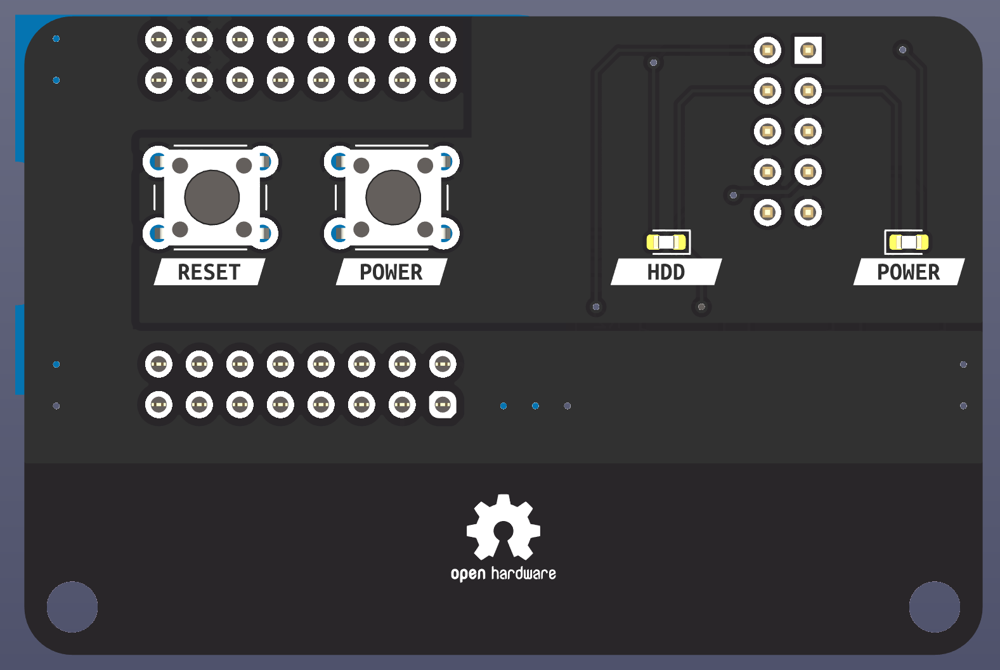
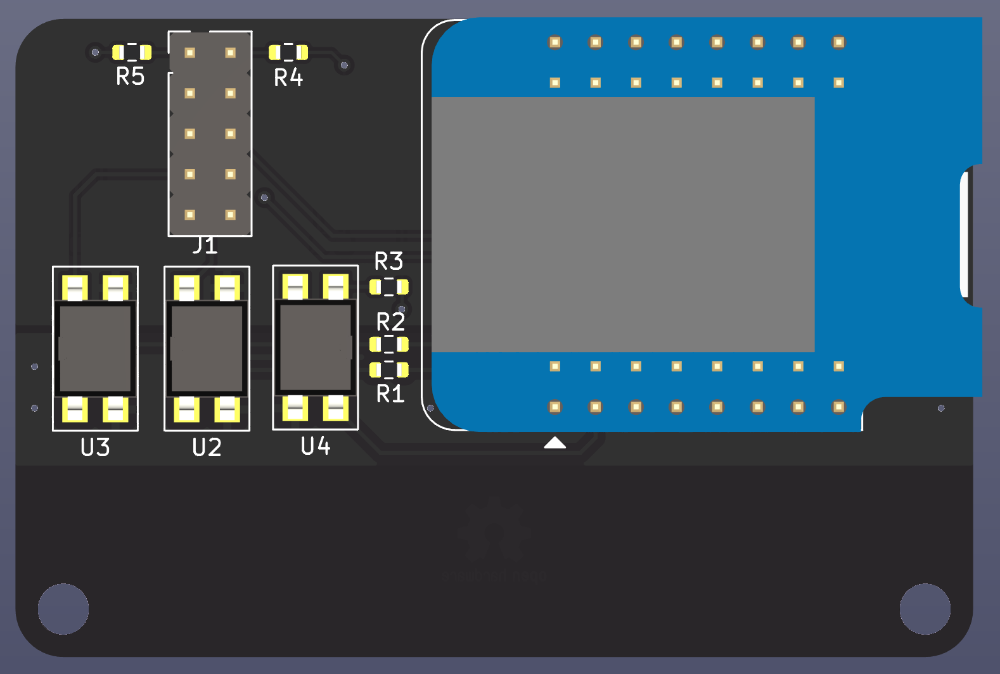
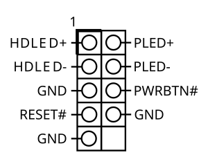

# WifiPowerButton

This small PCB let me control my home server remotly over WiFi.

My home server in my basement consists of a Asrock J3455-ITX which runs all my stuff and consumes relatively little power.
Unfortunately it dies every 2 months or so which requires me to go to the basement and reboot it.
That happen normally at the most inconvinient times and I hope that this little board lets me rebot it from everywhere in the world given my Internet connection works.
The brains of this project will be a WEMOS S2 mini because I have a dozen or so laying around ...

## Pictures

## Pinout

## Firmware

ToDo ...

I plan to use ESPHome for that.
